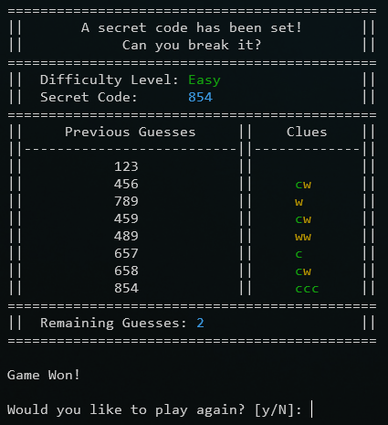

# Code Breaker

This is a simple, terminal based, code breaking game written in Python.

## Difficulty Levels

The game has three difficulty levels with varying code lengths. The player will be prompted to set the difficulty at the
beginning of each game

| Difficulty | Code Length |
| --- | --- |
| Easy | 3 |
| Medium | 4 |
| Hard | 5 |

## How to Play

During the game, the player will have 10 guesses to break the secret code. The game ends when the player runs out of
chances or successfully breaks the code.

Each turn, the player makes a guess, after which they will be given a clue about how close their guess matches the
secret code. Each clue is a string consisting of one or more of the following characters:

| Character | Meaning |
| --- | --- |
| c | A number is correct and in the right place |
| w | A number is correct but is in the wrong place |

Additional things to note about clues:
- The absence of a clue means that no numbers in the guess are correct
- The characters in each clue are sorted in alphabetical order so the order of each clue has no meaning.
- Duplicates of the same number will not generate additional information in the clue. If the code is `385` or `388` and
the player guesses `888`, they will only receive `c` as the clue instead of `cww` or `ccw` respectively.

The game will track guesses made and display the game's guess history for the player along with the clue for each guess.

Invalid guesses are any guess that contain letters, that are not the same length as the code, or that are duplicates of
previous guesses. Invalid guesses will not consume a guess and the player will be able to enter another value instead.

Use the clues from each guess to your advantage to break the code before you run out of chances.

## Screenshots

